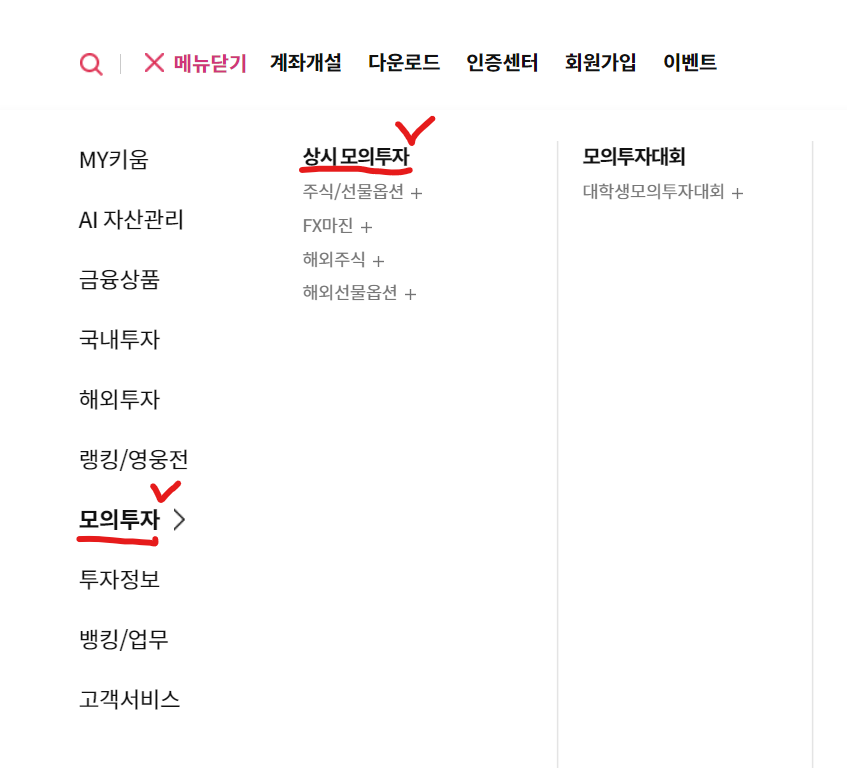
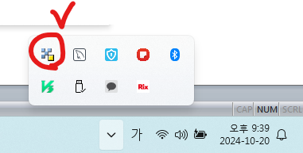

# 증권사 연동하기

## 키움증권 증권계좌
- open API 제공 (다른 증권사도 해줌)

## Open API
- 증권사마다 open API 제공한다.
1. 주식데이터 증권사로부터 가져오기위해 
2. 원하는 시점에서 매수매도 하도록 증권사 계좌와 자동 연동

## 상시 모의투자 신청
- 키움증권 홈페이지 -> 상시모의투자 -> 최하단 Open API 들어가서 다운로드 가능

## KOA Studio
- 증권사 요청데이터 종류 알수 있게 하는것
- 파일 -> open api 접속 
- error : OpenAPI OCX를 탑재한 프로그램을 종료하신 후 확인버튼을 눌러주시기 바랍니다 
확인 버튼 누르지말고, 프로그램 닫기 누름 그다음 확인버튼 누르면 해결
- 계좌비밀번호 저장  

  우측클릭 계좌비밀번호 저장